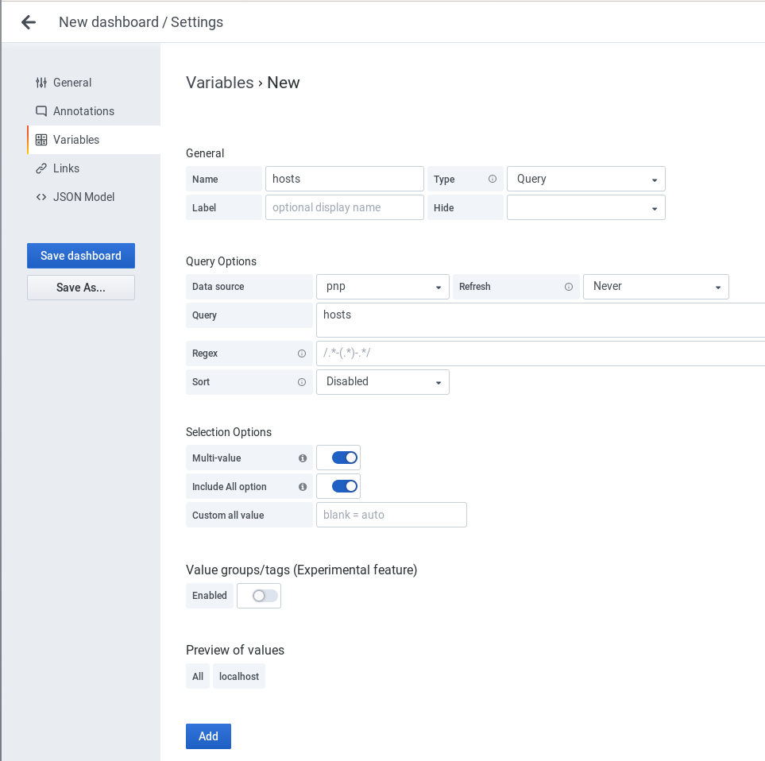

## PNP Grafana Datasource - a Grafana backend datasource using PNP4Nagios to access RRD files

### Installation

Search for `pnp` in the Grafana plugins directory or simply use the grafana-cli command:

    %> grafana-cli plugins install sni-pnp-datasource

Also [OMD-Labs](https://labs.consol.de/omd/) comes with this datasource included, so if
you use OMD-Labs, everything is setup already.

Otherwise follow these steps:

    %> cd var/grafana/plugins
    %> git clone -b release-1.0.7  https://github.com/sni/grafana-pnp-datasource.git
    %> restart grafana

Replace `release-1.0.7` with the last available release branch.

#### PNP API

In order to make this datasource work, you need the pnp api. This is a separate
project at the moment and will be part of the official pnp in the future. You
can fetch the `api.php` from https://github.com/lingej/pnp-metrics-api and place
it in your controler folder.

In a standard PNP setup, you could basically just download the api directly into
the controller folder with a simple wget:

    wget "https://github.com/lingej/pnp-metrics-api/raw/master/application/controller/api.php" \
         -O /usr/share/pnp4nagios/html/application/controllers/api.php

Adjust the output path to your installation.

### Create Datasource

Direct access and proxy datasources are possible.
Add a new datasource and select:

Variant A:

Uses the Grafana proxy. Must have a local user which is used for all queries.

    - Type 'PNP'
    - Url 'https://localhost/sitename/pnp4nagios'
    - Access 'proxy'
    - Basic Auth 'True'
    - User + Password for local pnp user

Variant B:

Uses direct access. PNP must be accessible from the public.

    - Type 'PNP'
    - Url 'https://yourhost/sitename/pnp4nagios' (Note: this has to be the absolute url)
    - Access 'direct'
    - Http Auth 'With Credentials'

### Example Dashboard

This datasource ships an example dashboard which gets you started and shows the
internal PNP statistics.

### Queries

Simply select host, service and label in the query editor. Regular expressions
are supported in the host and service field by adding slashes like `/.*/`.

### Variables

You may use the following variables in the alias field

    - $tag_host: will be replaced with the hostname
    - $tag_service: will be replaced with the service name
    - $tag_label: will be replaced with the label

### Templating

There is basic templating variable support. There are 3 different querys available:

    - $host:    hosts
    - $service: services where host = /^$host$/
    - $label:   labels where host = /^$host$/ and service = /^$service$/

### Development

#### Setup

The easiest way to setup a test environment is to install the latest omd-labs package and
clone this repository to to `~/var/grafana/plugins`. Make sure there is only one pnp
datasource, so you might have to remove the shiped one.
Then run `grunt watch` and eventually restart Grafana after doing changes.

To test and improve the plugin you can run Grafana instance in Docker using
following command (in the source directory of this plugin):

  %> make grafanadev

This will expose local plugin from your machine to Grafana container. Now
run `make buildwatch` to compile dist directory and start changes watcher:

  %> make buildwatch

#### Create Release

How to create a new release:

    %> export RELVERSION=1.0.8
    %> export GRAFANA_API_KEY=...
    %> vi CHANGELOG.md # add changelog entry
    %> git commit -am "Release v${RELVERSION}"
    %> git tag -a v${RELVERSION} -m "Create release tag v${RELVERSION}"
    %> make GRAFANA_API_KEY=${GRAFANA_API_KEY} clean releasebuild
    %> make releasepush

### Changelog

see CHANGELOG.md

